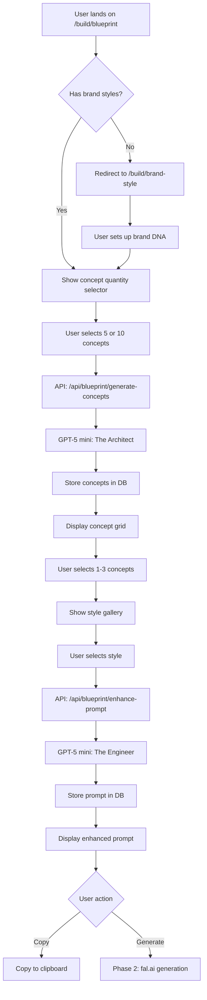

# Blueprint System Rebuild - Master Plan

**Status:** Planning Phase  
**Target:** Phase 1 - Blueprint Page + Brand DNA Setup  
**Future:** Phase 2 - Image Generation Integration (fal.ai)

---

## Executive Summary

This document outlines the complete rebuild of the **Blueprint** page (`/members/build/blueprint`) to transform it from a basic wizard into a **two-phase AI thumbnail concept engine** that generates professional thumbnail prompts optimized for specific AI image generation models.

### The Vision

**Current State:** Users manually select thumbnail type, style, colors, and text position → Get basic prompt → Copy to external tool → Add text manually in Canva/Photoshop

**Future State:** Users leverage rich session data → AI generates 5-10 visual concepts → User selects concept → AI creates model-specific prompt with text rendered as part of the image → One-click generation (Phase 2)

### Key Innovation

**Stop asking AI to "leave space for text"** → Instead, **render text as an object in the scene** (neon sign, sticker, hologram, 3D letters, etc.)

---

## Architecture Overview

### User Flow

```
build/title (Page 5)
  ↓ (User clicks "Design Thumbnail")
  ↓
build/brand-style (NEW - First-time users only)
  ↓ (Setup brand colors, avatar preferences, default vibe)
  ↓ (Can skip, returns here later)
  ↓
build/blueprint (REBUILT)
  ↓
  Step 1: Choose concept quantity (5 or 10 concepts)
  Step 2: AI generates visual concepts (GPT-5 mini)
  Step 3: User selects 1-3 concepts
  Step 4: Choose style from gallery (15 presets + custom)
  Step 5: AI enhances prompt (model-specific)
  Step 6: Copy prompt OR Generate image (Phase 2)
```

### Three-Tier Style System

We're building **15 curated styles** ranked by AI's ability to execute them flawlessly:

#### **Tier 1: AI Will Crush These** (8-10 styles)
Styles where current AI models (Gemini 3, Ideogram v2, Flux 1.1 Pro) excel. Clean, geometric, predictable layouts.

#### **Tier 2: Strong Potential** (4-5 styles)
Styles that work well but may require iteration or specific model selection.

#### **Tier 3: Experimental** (2-3 styles)
"Mad Scientist" styles we're actively testing and perfecting. Marked with a badge in the UI.

---

## The 15 Style Recipes

### Tier 1: Production-Ready Styles

#### 1. **Dark Mode Dashboard** (Firecrawl/Deep Agent Look)
- **Best for:** SaaS, Tech, AI, Cybersecurity
- **AI Model:** Gemini 3 (Nano Banana)
- **Why it works:** Clean geometric shapes, no complex textures
- **Text integration:** Rendered as glowing monospace text on dashboard screen
- **Use cases:** Tech tutorials, AI news, developer content

#### 2. **Modern Tech Vector** (Abacus/Corporate Memphis)
- **Best for:** Startups, Business, Education
- **AI Model:** Gemini 3
- **Why it works:** Flat design is AI's sweet spot
- **Text integration:** Floating speech bubble or UI card
- **Use cases:** Business advice, productivity, SaaS reviews

#### 3. **Glassmorphism** (Apple Vision Pro Aesthetic)
- **Best for:** Futuristic, AI, Crypto, Tech
- **AI Model:** Gemini 3
- **Why it works:** Simple gradients and blur effects
- **Text integration:** Etched into frosted glass panel with glow
- **Use cases:** AI tools, future tech, crypto analysis

#### 4. **3D Clay Toy** (Pixar/Vinyl Toy Style)
- **Best for:** Friendly, Approachable, Fun
- **AI Model:** Gemini 3
- **Why it works:** Soft 3D renders are Gemini's strength
- **Text integration:** Inflated 3D balloon letters on scene floor
- **Use cases:** Beginner tutorials, family content, wholesome topics

#### 5. **Isometric World** (SimCity/Monument Valley)
- **Best for:** Systems, Processes, Explainers
- **AI Model:** Gemini 3
- **Why it works:** Geometric, predictable, clean
- **Text integration:** Massive 3D block letters on floating island
- **Use cases:** How-to guides, system explanations, tech breakdowns

#### 6. **The Blueprint** (Engineering Schematic)
- **Best for:** Technical, How-It-Works, Deep Dives
- **AI Model:** Gemini 3
- **Why it works:** Technical drawings are structured
- **Text integration:** Stenciled project title in technical box
- **Use cases:** Engineering, architecture, technical analysis

#### 7. **GTA Loading Screen** (Comic Book Realism)
- **Best for:** Gaming, Entertainment, Storytelling
- **AI Model:** Gemini 3
- **Why it works:** Cel-shading is well-defined
- **Text integration:** "Pricedown" style font with black outline
- **Use cases:** Gaming content, pop culture, dramatic storytelling

#### 8. **Neon Gamer** (Esports/Dark Room Aesthetic)
- **Best for:** Gaming, Esports, High Energy
- **AI Model:** Ideogram v2 (text specialist)
- **Why it works:** Ideogram excels at neon text
- **Text integration:** Metallic chrome logo with glowing outline
- **Use cases:** Gaming, competitive content, hype videos

---

### Tier 2: Strong Potential

#### 9. **Hyper-Real Hype** (MrBeast Style)
- **Best for:** Viral, High CTR, Entertainment
- **AI Model:** Flux 1.1 Pro (or latest Flux)
- **Why it works:** Flux creates "crunchy" realistic skin textures
- **Text integration:** Massive Impact font with thick stroke floating next to head
- **Use cases:** Vlogs, challenges, viral content
- **Note:** Requires human face in concept

#### 10. **Sticker Bomb** (Gen Z/TikTok Collage)
- **Best for:** Chaotic, Fun, Young Audience
- **AI Model:** Ideogram v2
- **Why it works:** Ideogram handles layered text/stickers well
- **Text integration:** Die-cut sticker with grunge texture
- **Use cases:** TikTok-style content, memes, youth-focused

#### 11. **Double Exposure** (Silhouette + Scene)
- **Best for:** Conceptual, Artistic, Psychology
- **AI Model:** Gemini 3
- **Why it works:** Silhouette compositing is achievable
- **Text integration:** Elegant serif font in negative space
- **Use cases:** Mindset, philosophy, abstract concepts
- **Note:** May require iteration for perfect blend

#### 12. **Knolling Grid** (Overhead Flat Lay)
- **Best for:** Organization, Reviews, Comparisons
- **AI Model:** Gemini 3
- **Why it works:** Grid layouts are structured
- **Text integration:** Centered label in grid
- **Use cases:** Product reviews, organization, tech unboxing
- **Note:** Object placement precision can vary

---

### Tier 3: Experimental (Mad Scientist Lab)

#### 13. **Paper Diorama** (Layered Papercraft)
- **Best for:** Whimsical, Handcrafted, Cozy
- **AI Model:** Gemini 3
- **Why it's experimental:** Texture detail can look "too smooth"
- **Text integration:** White cardboard cutout standing in diorama
- **Use cases:** Storytelling, crafts, nostalgic content
- **Testing status:** Needs texture refinement

#### 14. **Neo-Brutalist** (Ugly-Cool Web Design)
- **Best for:** Ironic, Anti-Design, Edgy
- **AI Model:** Ideogram v2
- **Why it's experimental:** Niche aesthetic, hit-or-miss
- **Text integration:** Chaotic Times New Roman in jagged warning box
- **Use cases:** Design critique, internet culture, edgy content
- **Testing status:** Works but limited appeal

#### 15. **Retro VHS** (90s Horror/Conspiracy)
- **Best for:** Nostalgia, Horror, Mystery
- **AI Model:** Flux 1.1 Pro
- **Why it's experimental:** Requires heavy post-processing effects
- **Text integration:** Green VCR timestamp overlay
- **Use cases:** Horror, conspiracy, retro gaming
- **Testing status:** Hardest to nail, needs iteration

---

## Missing Styles to Consider

Based on YouTube thumbnail trends, here are **3 additional styles** we should add:

### **16. Bold Gradient Text** (Pure Typography Focus)
- **Best for:** Motivational, Quotes, Announcements
- **AI Model:** Ideogram v2
- **Why it works:** Ideogram is the world leader in text rendering
- **Text integration:** Massive gradient text IS the thumbnail
- **Use cases:** Motivational content, quotes, announcements
- **Recommendation:** Add to Tier 1

### **17. Split Screen Comparison** (Before/After, VS)
- **Best for:** Comparisons, Reviews, Transformations
- **AI Model:** Gemini 3
- **Why it works:** Structured layout, clear division
- **Text integration:** Text in center divider or top banner
- **Use cases:** Product comparisons, before/after, debates
- **Recommendation:** Add to Tier 1

### **18. Cinematic Movie Poster** (Hollywood Blockbuster)
- **Best for:** Dramatic, Epic, Storytelling
- **AI Model:** Flux 1.1 Pro
- **Why it works:** Flux handles dramatic lighting well
- **Text integration:** Movie-style title treatment at bottom
- **Use cases:** Epic storytelling, documentaries, dramatic reveals
- **Recommendation:** Add to Tier 2

> **Decision Point:** Should we expand to 18 styles, or keep it tight at 15? My recommendation: **Start with 15, add these 3 in Phase 1.5** after we validate the core system.

---

## Database Schema Additions

### New Tables

#### `brand_styles` - User's custom brand DNA
```typescript
export const brand_styles = pgTable('brand_styles', {
  id: uuid('id').primaryKey().defaultRandom(),
  user_id: uuid('user_id').notNull(),
  channel_id: uuid('channel_id').references(() => channels.id, { onDelete: 'cascade' }),
  
  // Brand identity
  name: text('name').notNull(), // "My Tech Brand", "Gaming Style", etc.
  is_default: boolean('is_default').default(false), // Auto-select this style
  
  // Colors
  primary_color: text('primary_color'), // Hex: "#FF5500"
  secondary_color: text('secondary_color'),
  accent_color: text('accent_color'),
  
  // Avatar preferences
  avatar_type: text('avatar_type'), // "human_male", "human_female", "no_humans", "custom"
  avatar_description: text('avatar_description'), // "Bearded man with glasses"
  
  // Default vibe
  default_vibe: text('default_vibe'), // "professional", "hype", "friendly", "edgy"
  
  // Style preferences
  preferred_styles: jsonb('preferred_styles'), // ["dark_mode_dashboard", "glassmorphism"]
  
  // Timestamps
  created_at: timestamp('created_at').defaultNow(),
  updated_at: timestamp('updated_at').defaultNow(),
});
```

#### `thumbnail_concepts` - AI-generated visual concepts (Phase 1)
```typescript
export const thumbnail_concepts = pgTable('thumbnail_concepts', {
  id: uuid('id').primaryKey().defaultRandom(),
  super_topic_id: uuid('super_topic_id').references(() => super_topics.id, { onDelete: 'cascade' }),
  user_id: uuid('user_id').notNull(),
  
  // Generation metadata
  generation_batch_id: uuid('generation_batch_id'), // Groups concepts from same API call
  concept_count: integer('concept_count'), // 5 or 10
  
  // The concept itself (text-only description)
  title: text('title').notNull(), // "Robot Hand Crushing Keyboard"
  description: text('description').notNull(), // 2-3 sentence visual description
  
  // AI recommendations
  emotion_match: text('emotion_match'), // "Fear + Urgency"
  recommended_styles: jsonb('recommended_styles'), // ["dark_mode_dashboard", "neon_gamer"]
  
  // User selection
  is_selected: boolean('is_selected').default(false),
  selected_at: timestamp('selected_at'),
  
  // Timestamps
  created_at: timestamp('created_at').defaultNow(),
});
```

#### `thumbnail_prompts` - Final enhanced prompts (Phase 1)
```typescript
export const thumbnail_prompts = pgTable('thumbnail_prompts', {
  id: uuid('id').primaryKey().defaultRandom(),
  concept_id: uuid('concept_id').references(() => thumbnail_concepts.id, { onDelete: 'cascade' }),
  super_topic_id: uuid('super_topic_id').references(() => super_topics.id, { onDelete: 'cascade' }),
  user_id: uuid('user_id').notNull(),
  
  // Style selection
  style_id: text('style_id').notNull(), // "dark_mode_dashboard"
  style_name: text('style_name'), // "Dark Mode Dashboard"
  
  // Brand DNA applied
  brand_style_id: uuid('brand_style_id').references(() => brand_styles.id),
  
  // The final prompt
  enhanced_prompt: text('enhanced_prompt').notNull(),
  
  // Model routing
  recommended_model: text('recommended_model'), // "gemini_3", "ideogram_v2", "flux_1.1_pro"
  
  // User hint (optional)
  user_hint: text('user_hint'),
  
  // Generation metadata
  gpt_model: text('gpt_model'), // "gpt-5-mini"
  generation_duration_ms: integer('generation_duration_ms'),
  estimated_cost_cents: integer('estimated_cost_cents'),
  
  // Phase 2: Image generation tracking
  image_url: text('image_url'), // Generated image URL (Phase 2)
  generated_at: timestamp('generated_at'),
  
  // Timestamps
  created_at: timestamp('created_at').defaultNow(),
});
```

#### `style_gallery` - The 15+ curated styles (seed data)
```typescript
export const style_gallery = pgTable('style_gallery', {
  id: uuid('id').primaryKey().defaultRandom(),
  
  // Style identity
  style_id: text('style_id').notNull().unique(), // "dark_mode_dashboard"
  name: text('name').notNull(), // "Dark Mode Dashboard"
  description: text('description').notNull(), // 2-3 sentences
  
  // Categorization
  tier: integer('tier').notNull(), // 1, 2, or 3
  tier_label: text('tier_label'), // "Production Ready", "Strong Potential", "Experimental"
  category: text('category'), // "tech", "viral", "artistic"
  
  // Best use cases
  best_for: jsonb('best_for'), // ["SaaS", "Tech", "AI"]
  use_cases: jsonb('use_cases'), // ["Tech tutorials", "AI news"]
  
  // AI model recommendation
  recommended_model: text('recommended_model'), // "gemini_3"
  model_display_name: text('model_display_name'), // "Gemini 3 (Nano Banana)"
  alternate_models: jsonb('alternate_models'), // ["ideogram_v2", "flux_1.1_pro"]
  
  // The prompt recipe (backend template)
  prompt_template: text('prompt_template').notNull(), // Full recipe from docs
  
  // Text integration strategy
  text_integration_rule: text('text_integration_rule'), // "Render as glowing monospace on screen"
  
  // Gallery display
  preview_image_url: text('preview_image_url'), // Thumbnail preview (we'll generate)
  example_images: jsonb('example_images'), // [url1, url2, url3] for carousel
  
  // Sorting
  sort_order: integer('sort_order').notNull(), // 1-18
  
  // Status
  is_active: boolean('is_active').default(true),
  is_experimental: boolean('is_experimental').default(false),
  
  // Timestamps
  created_at: timestamp('created_at').defaultNow(),
  updated_at: timestamp('updated_at').defaultNow(),
});
```

### Schema Additions to Existing Tables

#### `super_topics` - Add thumbnail tracking
```typescript
// Add these columns to existing super_topics table:
thumbnail_phrase: text('thumbnail_phrase'), // The 4-word phrase for thumbnail
thumbnail_concept_batch_id: uuid('thumbnail_concept_batch_id'), // Last concept generation
thumbnail_selected_concept_id: uuid('thumbnail_selected_concept_id'), // User's choice
thumbnail_final_prompt_id: uuid('thumbnail_final_prompt_id'), // Final enhanced prompt
thumbnail_image_url: text('thumbnail_image_url'), // Generated image (Phase 2)
```

---

## API Routes

### Phase 1: Concept Generation & Prompt Enhancement

#### `POST /api/blueprint/generate-concepts`
**Purpose:** First AI call - Generate 5 or 10 visual concepts (text-only)

**Input:**
```typescript
{
  topicId: string;           // UUID of super_topic
  conceptCount: 5 | 10;      // User's choice
}
```

**Process:**
1. Fetch `super_topic` data from database
2. Extract relevant fields:
   - `phrase` (keyword phrase)
   - `locked_title` (video title)
   - `primary_emotion` + `secondary_emotion`
   - `mindset`, `primary_bucket`, `sub_format`
   - `viewer_goal` (short version only)
3. Fetch channel data:
   - `niche`, `target_audience`
4. Call GPT-5 mini with system prompt (see below)
5. Store concepts in `thumbnail_concepts` table
6. Return concepts to frontend

**Output:**
```typescript
{
  concepts: [
    {
      id: string;
      title: string;
      description: string;
      emotionMatch: string;
      recommendedStyles: string[];
    }
  ],
  stats: {
    durationMs: number;
    costCents: number;
  }
}
```

#### `POST /api/blueprint/enhance-prompt`
**Purpose:** Second AI call - Convert concept + style into model-specific prompt

**Input:**
```typescript
{
  conceptId: string;         // Selected concept UUID
  styleId: string;           // e.g., "dark_mode_dashboard"
  brandStyleId?: string;     // Optional user brand DNA
  userHint?: string;         // Optional visual guidance
}
```

**Process:**
1. Fetch concept from `thumbnail_concepts`
2. Fetch style recipe from `style_gallery`
3. Fetch brand DNA from `brand_styles` (if provided)
4. Fetch super_topic data for context
5. Call GPT-5 mini with "Prompt Engineer" system prompt
6. Store in `thumbnail_prompts` table
7. Return enhanced prompt

**Output:**
```typescript
{
  enhancedPrompt: string;
  recommendedModel: string;  // "gemini_3", "ideogram_v2", "flux_1.1_pro"
  stats: {
    durationMs: number;
    costCents: number;
  }
}
```

#### `GET /api/blueprint/styles`
**Purpose:** Fetch all active styles from gallery

**Output:**
```typescript
{
  styles: [
    {
      id: string;
      styleId: string;
      name: string;
      description: string;
      tier: number;
      tierLabel: string;
      bestFor: string[];
      recommendedModel: string;
      previewImageUrl: string;
      exampleImages: string[];
      isExperimental: boolean;
    }
  ]
}
```

### Phase 2: Image Generation (Future)

#### `POST /api/blueprint/generate-image`
**Purpose:** Generate actual thumbnail image using fal.ai

**Input:**
```typescript
{
  promptId: string;          // UUID of thumbnail_prompt
  model?: string;            // Override recommended model
}
```

**Process:**
1. Fetch prompt from `thumbnail_prompts`
2. Route to appropriate fal.ai model
3. Generate image
4. Upload to storage (Supabase Storage or Cloudinary)
5. Update `thumbnail_prompts.image_url`
6. Return image URL

---

## GPT-5 Mini System Prompts

### Prompt 1: The Architect (Concept Generation)

```
You are a Creative Director specializing in YouTube thumbnail concepts. Your job is to generate ${conceptCount} distinct visual concepts for a thumbnail based on the topic and emotional context provided.

CRITICAL RULES:
1. Describe ONLY the visual elements and action - do NOT mention style, colors, or artistic techniques
2. Each concept should be 2-3 sentences maximum
3. Focus on concrete objects, people, and actions that can be visualized
4. Ensure concepts match the primary emotion: ${primaryEmotion}
5. Make concepts DISTINCT from each other - no variations of the same idea
6. Think about what will stop the scroll and create curiosity

CONTEXT:
- Keyword Phrase: "${phrase}"
- Video Title: "${lockedTitle}"
- Primary Emotion: ${primaryEmotion}
- Secondary Emotion: ${secondaryEmotion}
- Mindset: ${mindset}
- Video Format: ${subFormat}
- Channel Niche: ${niche}
- Target Audience: ${targetAudience}
- Viewer Goal: ${viewerGoal}

OUTPUT FORMAT:
Return a JSON array of ${conceptCount} concepts. Each concept must have:
{
  "title": "Short 3-5 word title",
  "description": "2-3 sentence visual description",
  "emotionMatch": "How this concept conveys ${primaryEmotion}",
  "recommendedStyles": ["style_id_1", "style_id_2", "style_id_3"]
}

For recommendedStyles, choose from: dark_mode_dashboard, modern_tech_vector, glassmorphism, clay_toy_3d, isometric_world, blueprint_schematic, gta_comic, neon_gamer, hyper_real_hype, sticker_bomb, double_exposure, knolling_grid, paper_diorama, neo_brutalist, retro_vhs

EXAMPLES:
Good: "A robot hand with glowing red joints is crushing a modern mechanical keyboard. Keys are flying outward in mid-air, with sparks and circuit board fragments scattering."

Bad: "A dramatic, high-contrast image of AI taking over coding jobs" (too vague, mentions style)
```

### Prompt 2: The Engineer (Prompt Enhancement)

```
You are a specialized Prompt Engineer for ${modelName}. Your job is to convert a visual concept into a detailed, model-specific image generation prompt.

CRITICAL INSTRUCTION:
Do NOT ask the AI to "leave space" for text. Instead, you must instruct the AI to RENDER THE TEXT as a physical object in the scene according to the style recipe.

INPUTS:
- Visual Concept: ${conceptDescription}
- Style Recipe: ${styleRecipe}
- Text to Render: "${thumbnailPhrase}"
- Brand Colors: Primary ${primaryColor}, Secondary ${secondaryColor}, Accent ${accentColor}
${userHint ? `- User Hint: "${userHint}"` : ''}

STYLE RECIPE:
${fullStyleRecipe}

YOUR TASK:
1. Merge the visual concept with the style recipe
2. Incorporate brand colors naturally
3. Follow the "Text Integration Rule" from the recipe EXACTLY
4. Ensure the text "${thumbnailPhrase}" is spelled perfectly and legible
5. Add technical details for ${modelName} (aspect ratio, quality settings, etc.)
${userHint ? '6. Incorporate the user hint naturally' : ''}

OUTPUT:
Return ONLY the final prompt as plain text. No JSON, no explanations.

The prompt should be 150-250 words and include:
- Aspect ratio: 16:9
- Style description
- Visual elements from concept
- Color specifications
- Text rendering instruction (following recipe)
- Lighting and mood
- Quality keywords for ${modelName}
```

---

## UI Component Structure

### New Pages

#### `/members/build/brand-style`
**Purpose:** One-time brand DNA setup (can return later to edit)

**Components:**
- `BrandStyleSetup.tsx` - Main page wrapper
- `ColorPicker.tsx` - Brand color selection
- `AvatarPreferences.tsx` - Avatar type selector
- `VibeSelector.tsx` - Default vibe picker
- `BrandStylePreview.tsx` - Live preview of selections

**Flow:**
1. Welcome screen: "Let's set up your brand style"
2. Color selection (3 colors: primary, secondary, accent)
3. Avatar preferences (human/no humans/custom description)
4. Default vibe (professional/hype/friendly/edgy)
5. Save & Continue (or Skip for now)

**First-time detection:**
```typescript
// Check if user has any brand_styles
const hasBrandStyles = await db.query.brand_styles.findFirst({
  where: eq(brand_styles.user_id, userId)
});

if (!hasBrandStyles) {
  // Show modal: "Want to set up your brand first?"
  // [Set Up Brand] [Skip for Now]
}
```

#### `/members/build/blueprint/styles`
**Purpose:** Style gallery - browse all 15+ styles

**Components:**
- `StyleGallery.tsx` - Main grid layout
- `StyleCard.tsx` - Individual style preview card
- `StyleModal.tsx` - Detailed view with carousel

**Layout:**
- Desktop: 5 columns × 3 rows (5x3 grid)
- Tablet: 3 columns × 5 rows
- Mobile: 1 column (vertical scroll)

**StyleCard:**
```tsx
<div className="style-card">
  
  <h3>{name}</h3>
  {isExperimental && <Badge>Mad Scientist Lab 🧪</Badge>}
  <p className="tier">Tier {tier}: {tierLabel}</p>
</div>
```

**StyleModal (on click):**
```tsx
<Modal>
  
  <Carousel images={exampleImages} />
  <h2>{name}</h2>
  <p>{description}</p>
  <div className="best-for">
    <h4>Best For:</h4>
    <Tags items={bestFor} />
  </div>
  <div className="recommended-model">
    <h4>Recommended AI:</h4>
    <p>{modelDisplayName}</p>
    {alternateModels.length > 0 && (
      <p>Also works with: {alternateModels.join(', ')}</p>
    )}
  </div>
  <Button>Use This Style</Button>
</Modal>
```

### Rebuilt Page

#### `/members/build/blueprint` (Complete Overhaul)
**Purpose:** Two-phase thumbnail concept & prompt generation

**New Flow:**

**Step 1: Concept Quantity**
```tsx
<div className="concept-quantity-selector">
  <h2>How many thumbnail concepts?</h2>
  <Button onClick={() => setConceptCount(5)}>
    5 Concepts
    <span className="cost">10 credits</span>
  </Button>
  <Button onClick={() => setConceptCount(10)}>
    10 Concepts
    <span className="cost">20 credits</span>
  </Button>
  <p className="tip">More concepts = more creative options for split testing</p>
</div>
```

**Step 2: AI Generation (Loading State)**
```tsx
<div className="generating-concepts">
  <Spinner />
  <h3>Generating {conceptCount} visual concepts...</h3>
  <p>Analyzing your topic, emotion, and audience...</p>
  <ProgressBar value={progress} />
</div>
```

**Step 3: Concept Selection**
```tsx
<div className="concept-grid">
  <h2>Choose 1-3 concepts to develop</h2>
  <p className="context">
    Phrase: <strong>{phrase}</strong> | 
    Emotion: <strong>{primaryEmotion}</strong>
  </p>
  
  {concepts.map(concept => (
    <ConceptCard
      key={concept.id}
      title={concept.title}
      description={concept.description}
      emotionMatch={concept.emotionMatch}
      recommendedStyles={concept.recommendedStyles}
      isSelected={selectedConcepts.includes(concept.id)}
      onSelect={() => toggleConcept(concept.id)}
    />
  ))}
  
  <Button 
    disabled={selectedConcepts.length === 0}
    onClick={handleNext}
  >
    Continue with {selectedConcepts.length} concept(s)
  </Button>
</div>
```

**Step 4: Style Selection**
```tsx
<div className="style-selection">
  <h2>Choose a style for your thumbnail</h2>
  
  {/* Quick brand style selector */}
  {userBrandStyles.length > 0 && (
    <div className="brand-styles">
      <h3>Your Brand Styles</h3>
      {userBrandStyles.map(brand => (
        <BrandStyleCard key={brand.id} {...brand} />
      ))}
    </div>
  )}
  
  {/* Style gallery preview (top 6) */}
  <div className="style-preview-grid">
    {topStyles.map(style => (
      <StyleCard key={style.id} {...style} />
    ))}
  </div>
  
  <Link href="/members/build/blueprint/styles">
    View All {totalStyles} Styles →
  </Link>
</div>
```

**Step 5: Prompt Enhancement**
```tsx
<div className="prompt-enhancement">
  <h2>Your Thumbnail Blueprint</h2>
  
  {/* Optional user hint */}
  <div className="user-hint">
    <label>💡 Want to guide the visual? (Optional)</label>
    <input
      type="text"
      placeholder='e.g., "Show a robot", "Use dark colors"'
      value={userHint}
      onChange={(e) => setUserHint(e.target.value)}
    />
  </div>
  
  {/* Enhanced prompt display */}
  {isEnhancing ? (
    <LoadingState />
  ) : (
    <div className="prompt-display">
      <h3>Enhanced Prompt</h3>
      <pre>{enhancedPrompt}</pre>
      <div className="model-info">
        <p>Recommended: {recommendedModel}</p>
      </div>
    </div>
  )}
  
  {/* Actions */}
  <div className="actions">
    <Button onClick={handleCopyPrompt}>
      <IconCopy /> Copy Prompt
    </Button>
    <Button disabled>
      <IconSparkles /> Generate Image (Coming Soon)
    </Button>
  </div>
</div>
```

---

## Implementation Phases

### Phase 1: Blueprint Page + Brand DNA (Current Focus)
**Timeline:** 2-3 days

**Deliverables:**
1. ✅ Database schema additions (4 new tables)
2. ✅ `/members/build/brand-style` page
3. ✅ Rebuilt `/members/build/blueprint` page
4. ✅ `/members/build/blueprint/styles` gallery
5. ✅ API routes for concept generation & prompt enhancement
6. ✅ GPT-5 mini integration
7. ✅ Seed data for 15 style recipes

**Success Criteria:**
- User can set up brand DNA
- User can generate 5-10 concepts
- User can select concepts and get enhanced prompts
- Prompts are model-specific and include text integration
- Copy-to-clipboard works flawlessly

### Phase 1.5: Style Gallery Polish (Optional)
**Timeline:** 1-2 days

**Deliverables:**
1. Generate preview images for all 15 styles
2. Generate 2-3 example images per style
3. Add 3 new styles (Bold Gradient, Split Screen, Cinematic)
4. User testing and iteration

### Phase 2: Image Generation Integration (Future)
**Timeline:** TBD

**Deliverables:**
1. fal.ai API integration
2. Model routing logic (Gemini 3, Ideogram v2, Flux)
3. Image storage (Supabase Storage or Cloudinary)
4. Credits system
5. Image generation UI
6. Download & edit features

**Blockers:**
- Need to confirm fal.ai can run image generation on separate server
- Need to validate model availability and pricing
- Need to test text rendering quality across models

---

## Data Flow Diagram



---

## Credits System (Phase 1 Planning)

### Credit Costs

| Action | Credits | Rationale |
|--------|---------|-----------|
| Generate 5 concepts | 10 | 1 GPT-5 mini call (~$0.01) |
| Generate 10 concepts | 20 | 1 GPT-5 mini call (~$0.02) |
| Enhance prompt | 5 | 1 GPT-5 mini call (~$0.005) |
| Generate image (Phase 2) | 50-100 | fal.ai cost varies by model |

### Credit Packages (Future)

- **Starter:** 100 credits - $5
- **Creator:** 500 credits - $20 (20% bonus)
- **Pro:** 2000 credits - $60 (40% bonus)

### Free Tier

- 50 credits on signup
- 10 credits per week for active users

---

## Testing Strategy

### Phase 1 Testing

#### Unit Tests
- [ ] Brand style CRUD operations
- [ ] Concept generation API
- [ ] Prompt enhancement API
- [ ] Style gallery queries

#### Integration Tests
- [ ] Full flow: brand setup → concept gen → prompt enhancement
- [ ] Edge cases: no brand styles, skip brand setup
- [ ] Error handling: API failures, invalid inputs

#### User Testing
- [ ] 5 users test brand setup flow
- [ ] 10 users test concept generation
- [ ] Validate prompt quality across different niches
- [ ] A/B test 5 vs 10 concepts

### Phase 2 Testing (Future)

#### Image Quality Tests
- [ ] Generate 100 images across all 15 styles
- [ ] Validate text rendering quality
- [ ] Compare Gemini 3 vs Ideogram v2 vs Flux
- [ ] Test brand DNA application

---

## Open Questions & Decisions

### Immediate Decisions Needed

1. **Style Count:** Start with 15 or expand to 18?
   - **Recommendation:** Start with 15, add 3 in Phase 1.5

2. **Brand Style Scope:** Channel-level or user-level?
   - **Current:** Channel-level (allows different brands per channel)
   - **Alternative:** User-level (simpler, one brand for all channels)

3. **Concept Storage:** Keep all concepts or only selected?
   - **Recommendation:** Keep all for analytics and future "regenerate" feature

4. **Style Gallery Images:** Generate now or placeholder?
   - **Recommendation:** Use placeholders initially, generate during Phase 1.5

### Future Decisions (Phase 2)

1. **Image Storage:** Supabase Storage or Cloudinary?
2. **Model Selection:** Auto-route or let user override?
3. **Credits System:** Prepaid or pay-as-you-go?
4. **Image Editing:** In-app editor or export to Canva?

---

## Success Metrics

### Phase 1 KPIs

- **Adoption:** % of users who complete brand setup
- **Engagement:** Avg concepts generated per user
- **Quality:** % of prompts copied (indicates usefulness)
- **Iteration:** Avg regenerations per concept
- **Style Popularity:** Which styles are most selected

### Phase 2 KPIs (Future)

- **Generation Rate:** % of prompts that lead to image generation
- **Quality Score:** User ratings of generated images
- **Text Accuracy:** % of images with correctly rendered text
- **Model Performance:** Success rate by model (Gemini vs Ideogram vs Flux)

---

## Next Steps

### Immediate (Today)

1. ✅ Review and approve this master plan
2. Create database migration for 4 new tables
3. Seed `style_gallery` table with 15 style recipes
4. Build `/members/build/brand-style` page
5. Build API route: `/api/blueprint/generate-concepts`

### This Week

6. Rebuild `/members/build/blueprint` page
7. Build `/members/build/blueprint/styles` gallery
8. Build API route: `/api/blueprint/enhance-prompt`
9. Test full flow end-to-end
10. User testing with 5 beta users

### Next Week (Phase 1.5)

11. Generate preview images for style gallery
12. Add 3 new styles (if approved)
13. Polish UI based on user feedback
14. Prepare for Phase 2 planning

---

## Appendix: Full Style Recipe Examples

### Example 1: Dark Mode Dashboard

**Style ID:** `dark_mode_dashboard`  
**Tier:** 1 (Production Ready)  
**Recommended Model:** Gemini 3 (Nano Banana)

**Prompt Template:**
```
Style: Cyberpunk SaaS Dashboard, dark mode aesthetic
Visuals: Matte black background (#0A0A0A) with subtle dark grey topographic map pattern, floating glassmorphism UI screens displaying code snippets and data visualizations, glowing neon ${BRAND_COLOR} accent borders around screens
Composition: Center-weighted, multiple floating screens arranged in depth
Text Rule: Render the text "${TEXT}" as the main header on the central dashboard screen in a monospaced coding font (e.g., "Fira Code", "JetBrains Mono"), glowing with ${BRAND_COLOR} color
Lighting: Dark moody atmosphere, tech wireframe aesthetic, high contrast between black background and glowing elements, subtle rim lighting on screens
Technical: 8k render, sharp digital precision, clean edges, professional tech aesthetic
Aspect Ratio: 16:9
Mood: Professional, futuristic, cybersecurity, developer-focused
```

### Example 2: Sticker Bomb

**Style ID:** `sticker_bomb`  
**Tier:** 2 (Strong Potential)  
**Recommended Model:** Ideogram v2

**Prompt Template:**
```
Style: YouTube thumbnail composite, Gen Z sticker art collage aesthetic
Visuals: Main subject cut out with a thick white border (3-5px) creating a sticker effect, background explosion of floating 3D emojis (😱🔥💯), abstract geometric shapes, speed lines radiating outward, vibrant chaotic energy
Colors: High saturation, clashing neon colors (hot pink, electric blue, lime green), ${BRAND_COLOR} as accent
Composition: Asymmetric, energetic chaos, paper texture overlay for authenticity
Text Rule: Render the text "${TEXT}" as a large die-cut sticker in the foreground with a white stroke outline, grunge texture, slight peel effect on corners, bold sans-serif font
Lighting: Flat, evenly lit, no dramatic shadows, bright and punchy
Technical: Collage aesthetic, visible layer separation, TikTok/YouTube thumbnail style
Aspect Ratio: 16:9
Mood: Chaotic, fun, young audience, high energy, viral
```

---

**End of Master Plan**

*Last Updated: December 11, 2025*  
*Version: 1.0*  
*Status: Ready for Implementation*
